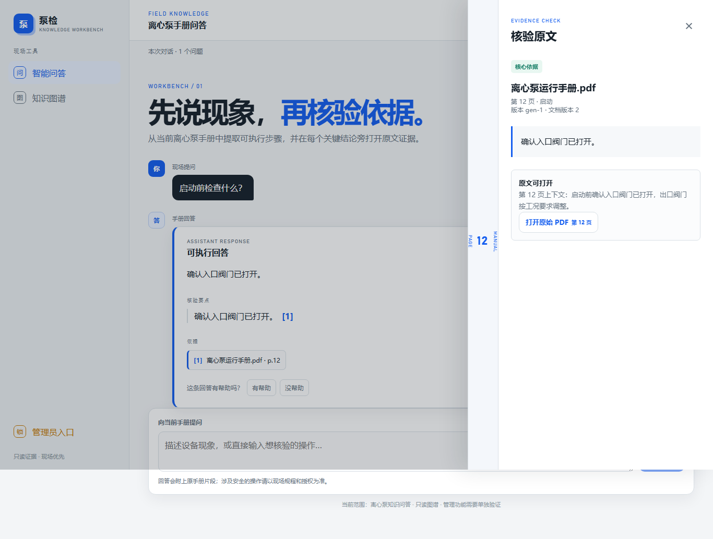
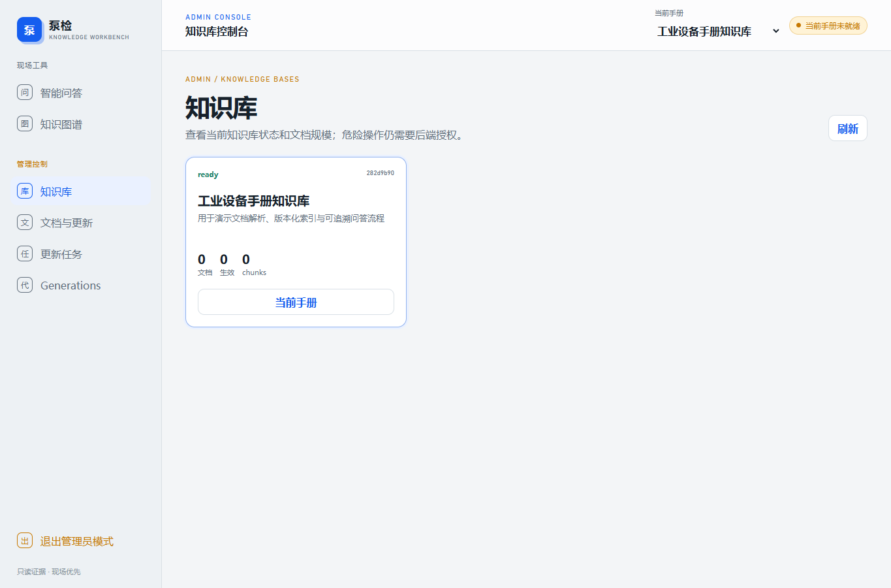
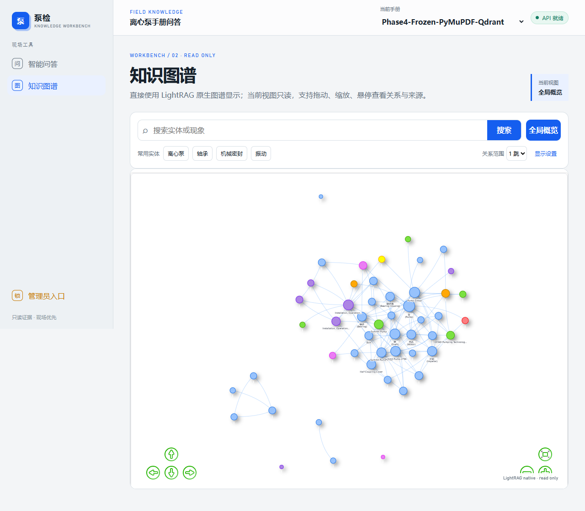
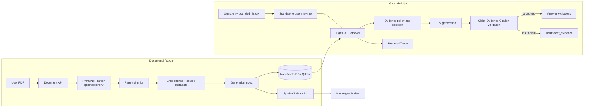

# Industrial LightRAG QA

### 面向工业设备手册的可追溯知识库问答系统

基于 LightRAG、FastAPI 与 Vue 构建的工业文档知识问答平台。项目面向长篇设备手册场景，重点处理检索召回、跨文档路由、证据引用、无依据回答和结果追溯，并使用人工黄金集、确定性指标与 Ragas Development 实验持续审计 RAG 质量。

> 项目只回答文档知识问题，不执行设备控制，也不把实验能力描述为生产能力。

## Demo

### 问答与原文核验

回答按要点绑定引用；引用抽屉展示服务端保存的文档名、物理页码、`chunk_id` 和受限原文摘录。



### Knowledge Base 管理

Vue 管理工作台提供知识库、文档更新任务和 Generation 生命周期入口。前端登录只负责导航保护，管理 API 仍由 FastAPI 校验 Bearer 权限。



### LightRAG 原生知识图谱

图谱页面读取当前知识库 Generation 生成的 GraphML，并通过项目内的 PyVis 渲染器展示实体、关系和邻域。



## 为什么做这个项目

工业手册问答的困难不只是“接入一个大模型”：

- 长文档切块后，命中的局部文本可能缺少章节上下文。
- 检索命中不等于最终答案受到证据支持。
- 让模型自行生成文件名、页码或引用容易产生不可核验信息。
- 多文档知识库可能把一个设备的问题错误路由到另一份手册。
- 没有相关证据时，模型仍可能给出看似合理的操作建议。
- 只观察答案是否流畅，无法定位问题发生在检索、证据选择、生成还是引用投影阶段。

因此，本项目把“答案是否可追溯”作为主链路约束：文档解析阶段保留来源元数据，检索阶段记录 Trace，生成后执行证据校验，证据不足时返回 `insufficient_evidence`。

## 核心能力

| 能力 | 当前实现 |
| --- | --- |
| 文档生命周期 | Knowledge Base、Document、异步更新任务与 Generation 版本管理 |
| 文档解析 | PyMuPDF 默认解析；MinerU 作为可选复杂版面解析器 |
| Chunking | Parent–Child 结构化切块；Child 用于索引，Parent 保留章节上下文 |
| Retrieval | LightRAG `local` / `global` / `hybrid` / `naive` / `mix` 查询模式 |
| Vector Store | NanoVectorDB 用于轻量启动；Qdrant 后端和 Generation 隔离真实实现 |
| Citation | 文档名、物理页码和 `chunk_id` 来自解析/检索元数据，不由模型编造 |
| Evidence Guard | 对答案要点、Evidence 和 Citation 做确定性校验与最小引用投影 |
| Refusal | 无可信引用或证据不足时返回 `insufficient_evidence` |
| Conversation | 最多 10 条有界历史；只用于 standalone query rewrite，不作为事实证据 |
| Observability | request/trace ID、检索结果、Query Rewrite 和 Grounding 诊断 |
| Knowledge Graph | LightRAG GraphML + 项目内 PyVis 只读图谱页面 |
| Evaluation | 人工黄金集、Recall@K、MRR、Citation、Refusal、Latency 和 Ragas 语义实验 |

当前冻结配置没有默认启用 Parent Expansion 或 Rerank。相关实现与实验记录保留在代码和 `evaluation/` 中，但 README 不把它们描述为线上默认链路。

## 系统架构



### 查询链路

1. API 根据当前知识库和激活的 Generation 选择隔离索引。
2. Query Rewriter 只在问题依赖历史指代时生成独立查询；失败或歧义会返回明确错误。
3. LightRAG 从 Child chunks 检索候选，并保留文档、页码和 chunk 身份。
4. Evidence Policy 过滤跨文档或不可信证据。
5. 生成结果经过 Answer Grounding、Claim–Evidence 匹配和 Citation Projection。
6. 公共响应只暴露可核验引用；完整诊断通过受保护的 Retrieval Trace 查询。

## Key Design Decisions

### 1. Parent–Child Chunking

固定长度切块容易把章节语义切断。解析服务先按标题、页码和内容块构建 Parent，再生成适合检索的 Child。索引与引用以 Child 为稳定身份，Parent 保留可选的上下文扩展能力。当前冻结生产配置保持 `parent_expansion_enabled=false`，避免把实验配置写成默认行为。

### 2. Citation Grounding

引用不是从模型自然语言中猜测页码。解析器为每个 Child 写入 `document_name`、`page_number` 和 `chunk_id`；查询服务只把实际检索、同 Generation 且通过校验的身份投影到公共响应。

### 3. Evidence Guard

系统将回答拆成可审计要点，并检查每个要点声明的 Evidence 是否能解析到公共 Child Citation。没有可信引用的回答不会以普通成功结果返回；部分支持和证据不足分别映射为 `partial_answer` 与 `insufficient_evidence`。

### 4. Retrieval Evaluation Before Answer Judging

答案质量下降可能来自召回失败，也可能来自生成或引用失败。评测因此分别记录 Recall@K、MRR、页面/证据召回、Citation、False Rejection、Latency 和错误率，而不是只给出一个主观 Answer Accuracy。

### 5. Evidence-neutral Conversation Rewrite

历史对话只用于消解“它”“上述步骤”等指代并生成 standalone query。历史文本不会注入证据集合；最终答案仍必须由当前知识库检索结果支持。

## Evaluation

所有数字均来自仓库内真实 JSON 产物。不同数据集和评测口径分开报告，不进行跨阶段拼接。

### Frozen retrieval baseline — 50 questions

官方 FastAPI 入口完成 50 道人工黄金集问题；48 道可回答问题进入检索指标分母，2 道负样本单独评估拒答。

| Metric | Result |
| --- | ---: |
| HTTP success | 50 / 50 |
| Recall@5 | 36 / 48 = **75.00%** |
| MRR@5 | **0.6201** |
| Gold Document Recall | 48 / 48 = **100%** |
| Gold Page Recall | 45 / 48 = **93.75%** |
| No-evidence Refusal | 2 / 2 = **100%** |
| Structurally valid citation audit | 50 / 50 |
| Invalid document/page/chunk references | **0** |

Sources: [`e2e/metrics.json`](evaluation/experiments/phase6/e2e/metrics.json), [`shadow_audit/validation_summary.json`](evaluation/experiments/phase6/shadow_audit/validation_summary.json).

这组结果是冻结检索基线，不代表所有答案质量门均通过。原始 Phase 6 曾因答案引用准确率门禁失败而拒绝 RC；随后 Phase 6B 统一 canonical 口径并保留历史结果，最终批准本地 RC，未执行生产部署。

### Accepted local staging — 20-question subset

受控本地 Staging 使用 18 道可回答问题和 2 道负样本，执行真实 Provider 请求及官方 FastAPI 路径。

| Metric | Result |
| --- | ---: |
| HTTP success | 20 / 20 = **100%** |
| Answer Citation Accuracy | 15 / 18 = **83.33%** |
| Emitted Citation Traceability | 15 / 15 = **100%** |
| No-evidence Refusal | 2 / 2 = **100%** |
| Answered without evidence | 0 / 18 |
| Error / fallback | 0 / 0 |
| P95 latency | **5.861 s** |

Source: [`phase8/acceptance/metrics.json`](evaluation/experiments/phase8/acceptance/metrics.json). Result status is `staging_deployment_approved=true`; no production deployment, Release Tag or GitHub Release was created.

### Experimental semantic evaluation

Ragas `0.3.9` is available through the `evaluation` optional dependency. Conversation-aware Faithfulness and Response Relevancy runs are Development-only experiments. Their status and provider availability are kept independent, and Development results are not presented as Validation/Holdout acceptance. See [`evaluation/phase10/`](evaluation/phase10/) and [`docs/phase-10-conversation-e2e-ragas-development-report.md`](docs/phase-10-conversation-e2e-ragas-development-report.md).

### Retrieval Foundation development evaluation

The development-only ranking helper in `industrial_rag.services.retrieval_evaluation`
reports Recall@5/10 and MRR@5/10 for baseline and candidate ranked child IDs.
Use [`evaluation/retrieval_foundation/dev_cases.jsonl`](evaluation/retrieval_foundation/dev_cases.jsonl)
as the labeled development dataset; it is intentionally separate from validation
and holdout artifacts. Call `evaluate_rankings(cases, rankings_by_system)` from a
development script to compare LightRAG, Sparse/RRF, and reranked outputs.

## Project Structure

```text
.
├── src/industrial_rag/     # FastAPI、LightRAG、检索、证据和生命周期服务
├── frontend/               # Vue 3 用户与管理工作台
├── app/                    # Streamlit 回退客户端
├── scripts/                # 启动、摄取、迁移和评测脚本
├── tests/                  # Python、API、评测与集成测试
├── evaluation/             # 冻结指标、实验实现和真实评测产物
├── docs/                   # 架构、设计决策与实验报告
├── data/                   # 本地文档入口和黄金集
├── migrations/             # Alembic 数据库迁移
└── config/                 # LightRAG 公共契约
```

## Quick Start

### Prerequisites

- Python `3.11`
- Node.js + npm
- 一个 OpenAI-compatible LLM/Embedding Provider
- 可选：Qdrant；默认 `VECTOR_BACKEND=nano` 可先完成轻量启动

### 1. Clone and install

```bash
git clone https://github.com/MM1ng/lightrag_industry_qa.git
cd lightrag_industry_qa
python -m venv .venv
```

Windows PowerShell：

```powershell
.venv\Scripts\Activate.ps1
python -m pip install --upgrade pip
pip install -e ".[dev]"
Copy-Item .env.example .env
```

Linux / macOS：

```bash
source .venv/bin/activate
python -m pip install --upgrade pip
pip install -e ".[dev]"
cp .env.example .env
```

如需运行 Ragas 语义评测：

```bash
pip install -e ".[dev,evaluation]"
```

### 2. Configure

编辑本地 `.env`，至少填写：

```env
DASHSCOPE_API_KEY=
SERVICE_API_KEY=
ADMIN_API_KEY=
```

保持空占位符的 `.env.example` 可以提交；真实 `.env`、Token 和 Provider Key 不得进入 Git。

### 3. Initialize and start the API

```bash
python -m alembic upgrade head
python -m uvicorn industrial_rag.api:app --host 127.0.0.1 --port 8000
```

检查：

```text
GET http://127.0.0.1:8000/health
GET http://127.0.0.1:8000/readyz
```

### 4. Start the Vue workbench

```bash
npm --prefix frontend install
npm --prefix frontend run dev
```

打开 `http://127.0.0.1:5173/chat`。管理员入口为 `/admin/login`；凭据只保存在页面内存中，所有管理请求仍由后端鉴权。

### 5. Add your documents

原始工业手册不随仓库分发。进入管理端创建 Knowledge Base 并上传自己的 PDF，或参考 [`data/manuals/README.md`](data/manuals/README.md)。解析、Parent–Child Chunking、索引和 Generation 激活通过文档生命周期任务执行。

## Verification

```bash
python -m pytest -q
python -m ruff check .
npm --prefix frontend run build
```

真实 MinerU、Qdrant 和 Provider E2E 测试是显式 opt-in；普通单元测试通过不等于真实外部集成已执行。

## Current Boundaries

- 已实现面向文档证据的问答、引用、知识库管理、图谱和离线评测。
- 当前默认配置不启用 Rerank 或 Parent Expansion。
- Ragas 语义结果属于 Development 实验，不等同于最终 Holdout 认证。
- 项目没有执行生产部署，也不控制真实工业设备。
- 多 Agent、LangGraph 编排、工单审批和通用工业运维平台不在当前作品集范围内。
- 原始厂商手册、运行数据库、模型缓存、向量索引和真实密钥不会随仓库分发。

## Further Reading

- [`docs/current-system-flow.md`](docs/current-system-flow.md) — 当前系统数据流
- [`docs/parent-child-chunking-design.md`](docs/parent-child-chunking-design.md) — Parent–Child 设计与实验边界
- [`docs/architecture-audit.md`](docs/architecture-audit.md) — 架构审计
- [`docs/phase-6-production-readiness-report.md`](docs/phase-6-production-readiness-report.md) — 50 题官方入口评测
- [`docs/phase-8-staging-deployment-report.md`](docs/phase-8-staging-deployment-report.md) — 本地 Staging 验收

## License and Data

本仓库目前未声明开源许可证；在许可证补充前，不应默认获得复制、修改或再分发代码的授权。工业手册及其他业务文档还可能受第三方版权、合同或数据合规要求约束，请只上传和评测你有权使用的内容。
