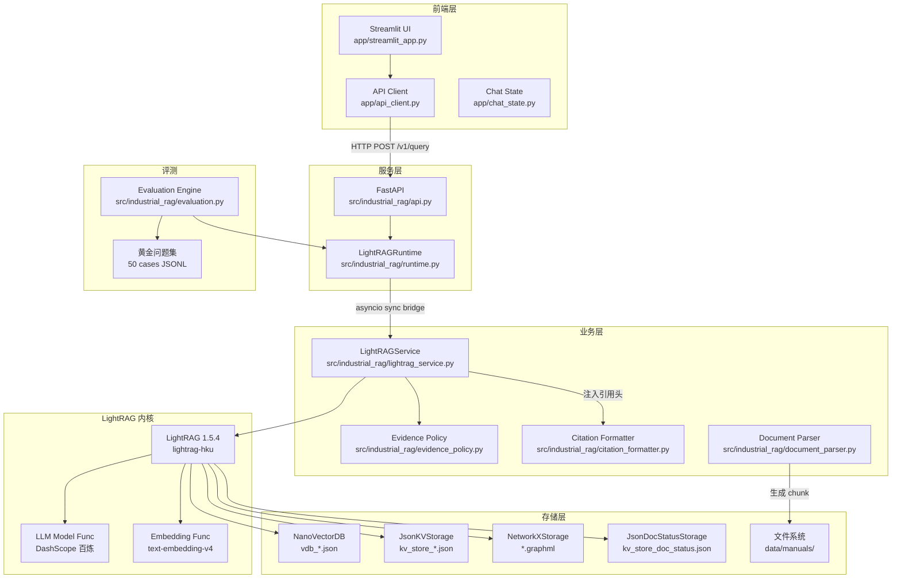
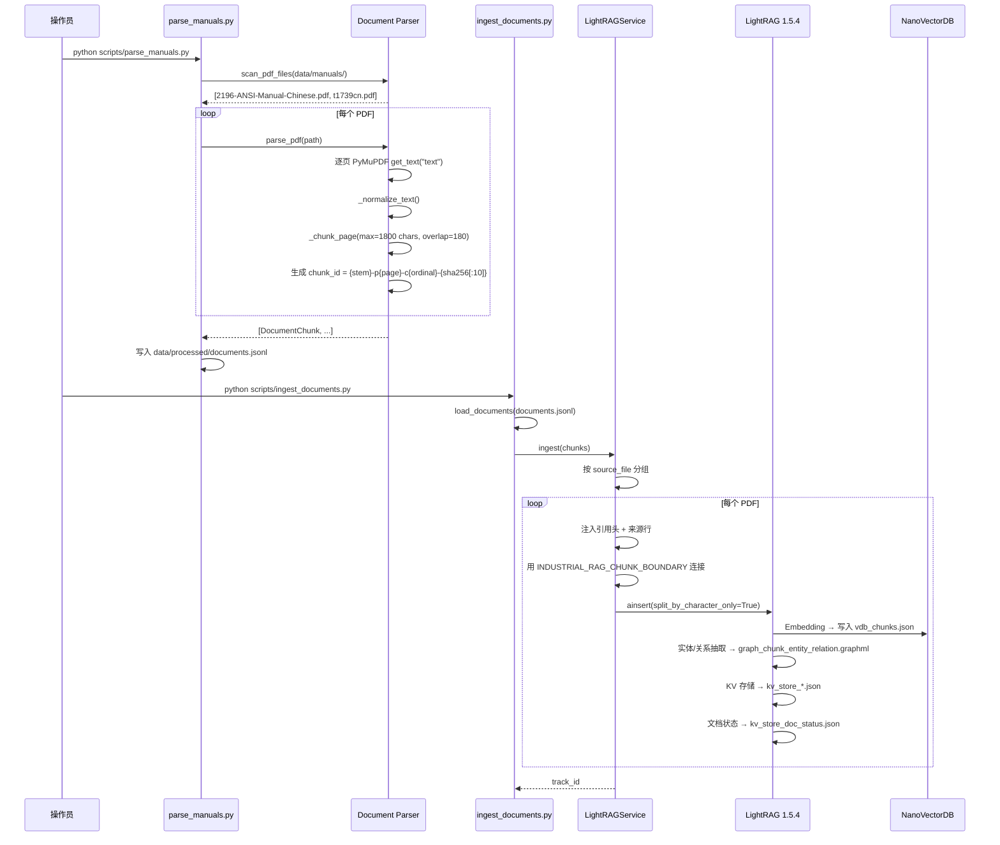
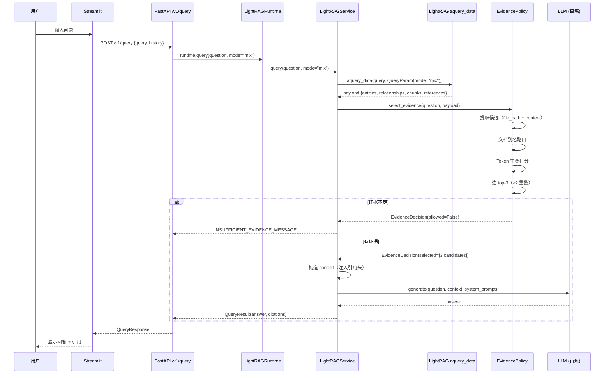
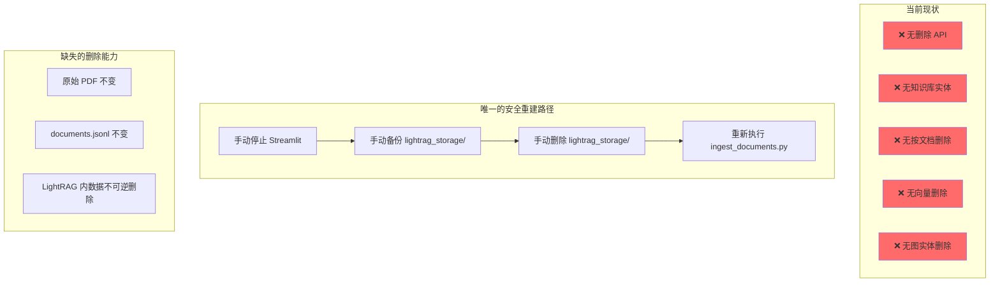

# 工业能源知识问答系统 — 架构审计报告

**日期**: 2026-07-30
**分支**: `codex/knowledge-qa-platform-design`
**主分支**: `feature/lightrag-qa-mvp`
**审计人**: Claude Opus 4.8 (Architecture Audit Agent)

---

## 1. 审计结论摘要

### 当前项目已经完成什么

已完成的是一个**收敛的单 LightRAG 知识库问答 MVP**，核心链路已验证并上线：

- ✅ PyMuPDF PDF 解析（带页码、章节、稳定 chunk_id）
- ✅ LightRAG 1.5.4 索引（NanoVectorDB + NetworkX + JSON KV）
- ✅ 阿里云百炼 Qwen/模型接入（模型自动故障切换）
- ✅ 5 种检索模式 (`mix`/`hybrid`/`local`/`global`/`naive`)
- ✅ 确定性证据策略（文档别名路由 + token 重叠门控）
- ✅ FastAPI 问答服务 (`/v1/query` + `/readyz`)
- ✅ Streamlit 前端（问答 + 知识图谱可视化）
- ✅ 50 题黄金问题集自动评估（Recall@5 + MRR + 引用可追溯率 + 拒答率）
- ✅ 225 个单元测试全部通过，零 lint 错误
- ✅ Python 3.11 环境锁定

### 当前项目最缺什么

| 缺失项 | 影响范围 |
|--------|---------|
| **知识库实体** | 系统中不存在"知识库"概念，只有一个 workspace/目录 |
| **知识库生命周期** | 无法新增、编辑、删除、切换知识库 |
| **文档管理 API** | 无上传、删除、重新解析、重新索引接口 |
| **Parent-Child 切块** | LightRAG 自己做二次切块（1600 token），未保存父子关系 |
| **Qdrant** | 当前使用 NanoVectorDB（JSON 文件向量），无 Qdrant 服务 |
| **Rerank** | QueryOptions 中有 `enable_rerank=False`，未真正启用 |
| **LangGraph** | 当前未集成，所有编排逻辑在同步桥 `LightRAGRuntime` 中 |
| **多跳推理** | 不存在 |
| **MinerU** | 未接入，使用 PyMuPDF 做文本提取 |
| **Next.js 前端** | 不存在 |
| **数据库** | 无关系数据库，所有状态存在 JSON 文件中 |

### 哪些规划可以直接实施

1. **知识库数据模型** — 可以新增 Pydantic models，不影响现有链路
2. **Qdrant** — LightRAG 1.5.4 原生支持 `QdrantVectorDBStorage`，切换成本低
3. **Rerank** — LightRAG 已有 `rerank_model_func` 参数，直接提供即可
4. **文档上传 API** — 新增 FastAPI 路由，不影响现有 `/v1/query`

### 哪些规划需要先解决基础问题

1. **MinerU** — 需要 GPU 环境、部署 MinerU 服务、评估 PDF 是否真的需要
2. **Parent-Child 切块** — 需要理解 LightRAG 内部切块机制、设计父子存储方案
3. **多跳推理** — 需要先集成 LangGraph、确认业务问题上确实存在多跳需求
4. **Next.js 前端** — 需要全新项目、独立部署
5. **知识库删除** — 需要解决跨 LightRAG 存储的数据一致性

### 当前最大技术风险

**知识库删除的数据一致性**（P0）：当前 NanoVectorDB 向量、JSON KV、NetworkX 图谱均无按文档删除的机制，删除一个"知识库"需要跨 4 种存储做级联删除，目前不存在删除路径。

---

## 2. 当前技术栈和版本

| 依赖 | 实际版本 | 来源文件 |
|------|---------|---------|
| Python | 3.11.15 | `environment.yml` |
| lightrag-hku | 1.5.4 | `requirements.lock.txt` |
| FastAPI | 0.140.0 | `conda run -n industrial-rag pip list` |
| Pydantic | 2.13.4 | `requirements.lock.txt` |
| Uvicorn | 0.51.0 | `requirements.lock.txt` |
| Starlette | 1.3.1 (implied by FastAPI) | `requirements.lock.txt` |
| Streamlit | 1.60.0 | `conda run -n industrial-rag pip list` |
| PyMuPDF | 1.28.0 | `requirements.lock.txt` |
| OpenAI SDK | 2.46.0 | `requirements.lock.txt` |
| LangChain | 1.3.14 (core: 1.5.0) | `requirements.lock.txt` |
| LangGraph | 0.6.11 | `conda run -n industrial-rag pip list` |
| NetworkX | 3.6.1 | `conda run -n industrial-rag pip list` |
| PyVis | 0.3.2 | `requirements.lock.txt` |
| HTTPx | 0.28.1 | `requirements.lock.txt` |
| Qdrant Client | 1.18.0 | `conda run -n industrial-rag pip list` |
| pytest | 9.1.1 | `requirements.lock.txt` |
| pytest-asyncio | 1.4.0 | `requirements.lock.txt` |
| Ruff | 0.16.0 | `conda run -n industrial-rag pip list` |
| **MinerU** | **未安装** | — |
| **DashScope SDK** | **代码中未直接使用** (通过 LightRAG `openai_complete_if_cache` 调用) | — |
| **Rerank 依赖** | **未安装** | — |
| **Node.js** | **无前端项目** | — |

### 版本差异说明

- `pyproject.toml` 声明强依赖 `lightrag-hku==1.5.4`，`requirements.txt` 一致，锁文件一致。无差异。
- `requirements.lock.txt` 中 `fastapi==0.139.2`，但 conda env 实际安装了 `0.140.0`。差异在 patch 级别，不影响。
- `requirements.lock.txt` 中 `langgraph==1.2.9`，但 conda env 实际安装了 `0.6.11`。这是**显著差异**：锁文件中 langgraph 1.x 与 conda env 中的 0.6.11 是不同大版本，API 不兼容。但当前代码**未使用 LangGraph**，所以不影响运行。
- `pyproject.toml` 声明 `streamlit>=1.46,<2`，但未声明 `httpx`、`fastapi`、`uvicorn`。这些作为隐式依赖被安装。
- `requirements.txt` 缺失 `httpx`、`fastapi`、`uvicorn` 等，与 `pyproject.toml` 不同步（后者包含但版本声明更宽）。

---

## 3. 当前项目结构

```
<REPO_ROOT>\
├── src/industrial_rag/           # 核心 Python 包
│   ├── __init__.py               # 导出 LightRAGService, Settings
│   ├── config.py                 # Settings, 存储兼容性检查
│   ├── lightrag_service.py       # LightRAG 初始化、索引、查询
│   ├── runtime.py                # 同步桥（Streamlit ↔ async LightRAG）
│   ├── api.py                    # FastAPI 应用 (create_app)
│   ├── document_parser.py        # PyMuPDF 解析 + chunk
│   ├── citation_formatter.py     # 引用编码/解码/格式化
│   ├── evidence_policy.py        # 确定性证据策略（路由+门控）
│   ├── evaluation.py             # 黄金集评估引擎
│   ├── graph_visualizer.py       # 知识图谱可视化 (PyVis)
│   └── graph_display_mapping.py  # 实体/类型中英文映射
├── app/                          # Streamlit 前端
│   ├── streamlit_app.py          # 主页面（问答 + 图谱）
│   ├── api_client.py             # HTTP 客户端（访问 FastAPI）
│   ├── chat_state.py             # 聊天状态管理（纯 Python）
│   ├── p3_chat.py                # API 响应到 UI 状态的适配
│   └── ui_theme.py               # CSS 设计令牌
├── scripts/                      # CLI 脚本
│   ├── inspect_environment.py    # 环境检查
│   ├── parse_manuals.py          # PDF 解析（生成 documents.jsonl）
│   ├── ingest_documents.py       # 导入 LightRAG
│   ├── smoke_test.py             # 离线/真实冒烟测试
│   ├── evaluate.py               # 黄金集评估运行器
│   └── import_golden_set.py      # 黄金集格式转换
├── tests/                        # 单元测试（228 通过）
│   ├── test_api.py               # FastAPI 端点测试
│   ├── test_runtime.py           # 同步桥测试
│   ├── test_lightrag_service.py  # LightRAG 服务测试
│   ├── test_document_parser.py   # PDF 解析测试
│   ├── test_evidence_policy.py   # 证据策略测试
│   ├── test_evaluation.py        # 评估引擎测试
│   ├── test_config.py            # 配置测试
│   ├── test_citation_formatter.py # 引用格式化测试
│   ├── test_graph_visualizer.py  # 图谱可视化测试
│   ├── test_api_client.py        # HTTP 客户端测试
│   ├── test_chat_state.py        # 聊天状态测试
│   └── test_p3_chat.py           # API 适配测试
├── data/
│   ├── manuals/                  # 2 份原始 PDF
│   │   ├── 2196-ANSI-Manual-Chinese.pdf
│   │   └── t1739cn.pdf
│   ├── processed/
│   │   └── documents.jsonl       # 解析后的 chunk（JSONL）
│   └── evaluation/
│       ├── golden_questions.example.jsonl
│       └── industrial_pump_golden_set_50.jsonl
├── lightrag_storage/             # LightRAG 数据（JSON 文件）
│   ├── industrial_rag_index.json # 维度标记
│   ├── graph_chunk_entity_relation.graphml
│   ├── kv_store_*.json           # KV 存储
│   └── vdb_*.json                # NanoVectorDB 向量
├── config/
│   └── lightrag_contract.json    # LightRAG Server 接口探针记录
├── pyproject.toml                # 项目元数据 + 依赖
├── requirements.txt              # 依赖声明
├── requirements.lock.txt         # 锁文件
├── .env.example                  # 环境变量模板
├── environment.yml               # Conda 环境
├── README.md                     # 项目文档
└── .worktrees/                   # 多个历史 worktree
    ├── phase-1-fastapi-service-foundation/
    ├── phase-2-vector-retrieval/
    ├── phase-3-langgraph-qa-workflow/
    ├── lightrag-qa-mvp/
    └── minimal-fastapi-qa/
```

---

## 4. 当前架构图

### 4.1 系统组件图



### 4.2 当前文档入库流程



### 4.3 当前问答流程



### 4.4 当前知识库"删除"流程（不存在）



---

## 5. 当前入库流程（详细调用链）

### 步骤 1: PDF 解析

**文件**: `scripts/parse_manuals.py` → `src/industrial_rag/document_parser.py`

1. `scan_pdf_files(MANUAL_DIR)` — 扫描 `data/manuals/` 下所有 `.pdf` 文件
2. `parse_pdf(path, ParserConfig)` — 对每个 PDF:
   - PyMuPDF 逐页 `get_text("text", sort=True)`
   - `_normalize_text()` — 规范化空白和换行
   - `_section_title()` — 取第一行非空短文本作章节名
   - `_chunk_page()` — 按 1800 字符切块，180 字符重叠
   - chunk_id = `{stem}-p{page}-c{ordinal}-{sha256[:10]}`
3. 写入 `data/processed/documents.jsonl`（JSONL 格式）

**关键参数**: `max_characters=1800`, `overlap_characters=180`（字符级，非 token 级）

### 步骤 2: LightRAG 索引

**文件**: `scripts/ingest_documents.py` → `src/industrial_rag/lightrag_service.py`

1. `load_documents(DOCUMENTS_PATH)` — 加载 JSONL
2. `LightRAGService.ingest(chunks)`:
   - 按 `source_file` 分组
   - 每个 chunk 注入 `[[INDUSTRIAL_RAG_SOURCE file=... page=... chunk=...]]` 头
   - 注入 `[来源：文件名，第X页，章节：XXX]` 行
   - 用 `<<<INDUSTRIAL_RAG_CHUNK_BOUNDARY>>>` 连接同文档所有 chunk
   - 每个文档生成 `identity = sha256(所有chunk_id).hexdigest()[:20]`
   - 调用 `LightRAG.ainsert(ids=[manual-{identity}], split_by_character_only=True)`
3. LightRAG 内部:
   - 按 `INDUSTRIAL_RAG_CHUNK_BOUNDARY` 切分（`split_by_character_only=True`）
   - 对每个分段做 `chunk_token_size=1600` 的二次切块
   - Embedding → NanoVectorDB (`vdb_chunks.json` / `vdb_entities.json` / `vdb_relationships.json`)
   - 实体/关系抽取 → NetworkX → GraphML
   - KV 存储 → JSON 文件

**关键参数**:
- `chunk_token_size=1600`（LightRAG 内部，使用 tiktoken 计数）
- `enable_content_headings=True`
- `entity_extract_max_gleaning=0`
- `embedding_dim=1024`
- `max_parallel_insert=1`

---

## 6. 当前检索流程（详细调用链）

1. **用户输入** → `app/streamlit_app.py::_submit_question()`
2. **HTTP 调用** → `app/api_client.py::KnowledgeApiClient.query()` → `POST /v1/query`
3. **FastAPI 处理** → `src/industrial_rag/api.py::query()` — 验证认证、运行时可用性
4. **同步桥** → `src/industrial_rag/runtime.py::LightRAGRuntime.query()` — `run_coroutine_threadsafe` 到后台 event loop
5. **异步查询** → `src/industrial_rag/lightrag_service.py::LightRAGService.query()`:
   - 调用 `LightRAG.aquery_data(query, QueryParam(mode="mix"))`
   - **检索模式固定为 mix**（API 层不接收 mode 参数）
   - LightRAG mix = local + global + naive 结果融合
6. **证据策略** → `src/industrial_rag/evidence_policy.py::select_evidence()`:
   - 从 `payload["data"]["chunks"]` 和 `payload["data"]["references"]` 提取候选
   - 文档别名路由（"summit" → 2196, "desmi" → t1739）
   - Token 重叠打分（去停用词 + CJK n-gram + 条件归一化）
   - 选 top-3（需要 ≥2 个共享 token）
   - 如果路由到单个文档，排除不同文档的候选
7. **上下文构建** → 将选中的 candidate 注入 `encode_chunk_header` 头
8. **生成** → `LightRAGService._backend.generate()` → `llm_model_func()` → DashScope 百炼 API
9. **引用提取** → `src/industrial_rag/citation_formatter.py::collect_citations()` — 从 chunk 的 `file_path` 解码引用

### 当前检索链路特征

| 特征 | 状态 |
|------|------|
| 检索入口 | `LightRAG.aquery_data()` |
| 检索模式 | 固定 `mix` |
| 图检索 | ✅ LightRAG mix 内含 global（图）|
| 向量检索 | ✅ LightRAG mix 内含 local + naive（向量）|
| BM25 | ❌ |
| Rerank | ❌ `enable_rerank=False` |
| 外部向量检索 | ❌ |
| 自定义融合 | ✅ `evidence_policy.py`（后处理）|
| 只返回检索上下文 | ❌ 无纯检索接口 |
| 引用来源 | chunk 的 `file_path` 中编码的 provenance |

---

## 7. 当前知识库管理能力

### 新增

❌ **不存在**。系统只有一个固定的 `lightrag_storage/` 目录。无 API、无 UI、无数据模型。

### 查询

❌ **不存在**。无法列出知识库或查询知识库信息。`/readyz` 只返回运行时状态。

### 编辑

❌ **不存在**。无法修改知识库名称、描述、配置。

### 删除

❌ **不存在**。唯一"删除"方式是手动备份和删除 `lightrag_storage/` 目录。

### 文档管理

❌ **不存在**。文档上传通过两个独立脚本完成 (`parse_manuals.py` + `ingest_documents.py`)。无 API、无 UI、无状态追踪。

### 状态管理

⚠️ **部分存在**。LightRAG 内部维护 `kv_store_doc_status.json`（包含 `status`, `chunks_count`, `track_id` 等字段），`industrial_rag_index.json` 记录 embedding 模型和维度。但这些仅用于兼容性检查，不对外暴露。

### 数据隔离

❌ **不存在**。所有数据共享一个 `lightrag_storage` 目录。无 workspace 或 knowledge base 级别的隔离。

---

## 8. 当前测试状态

### 执行命令

```powershell
conda run -n industrial-rag python -m pytest -q
conda run -n industrial-rag python -m ruff check .
conda run -n industrial-rag python scripts/inspect_environment.py
```

### 测试结果

| 项目 | 结果 |
|------|------|
| 总测试数 | 228 |
| 通过 | 228 ✅ |
| 失败 | 0 |
| 错误 | 0 |
| 跳过 | 0 |
| 警告 | 1 (StarletteDeprecationWarning) |
| Ruff lint | All checks passed ✅ |
| 环境检查 | 8/8 PASS ✅ |

### 未能执行的测试

- **真实百炼 API 测试**: `python scripts/smoke_test.py --real` — 需要本地配置 API Key，在审计阶段未执行（不影响离线测试结果）
- **Mypy 类型检查**: 锁文件中有 `mypy==1.20.2`，但没有 `mypy.ini` 配置或 CI 步骤
- **Docker Compose config 校验**: 主项目根目录无 Dockerfile 或 compose.yaml（仅在 worktree 中存在）

---

## 9. 发现的问题

### P0：阻塞后续升级

| # | 现象 | 证据 | 影响 | 建议处理阶段 |
|---|------|------|------|------------|
| P0-1 | 无"知识库"实体 | `grep -r "knowledge.base" src/` 无匹配 | 无法实现知识库 CRUD、多知识库切换 | 阶段 3 |
| P0-2 | 无删除路径 | LightRAG 4 种存储均无按文档删除 API | 无法安全删除单个文档或知识库 | 阶段 3 |
| P0-3 | 无 Parent-Child 切块 | LightRAG 做二次切块（1600 token），结果 chunk ID 与原始 `DocumentChunk.chunk_id` 不一致 | 引用无法追溯到精确的原始 chunk | 阶段 2 |
| P0-4 | 无关系数据库 | 所有数据存在 JSON 文件中 | 无法做事务性操作、并发安全、元数据查询 | 阶段 3 |

### P1：高风险

| # | 现象 | 证据 | 影响 | 建议处理阶段 |
|---|------|------|------|------------|
| P1-1 | requirements.txt 与 pyproject.toml 不同步 | `requirements.txt` 缺少 `fastapi`, `uvicorn`, `httpx` | 新开发者用 `pip install -r requirements.txt` 会失败 | 阶段 1 |
| P1-2 | LightRAG 切块与上传 chunk ID 不一致 | LightRAG 内部 `chunk_token_size=1600` 二次切块，生成自己的 chunk ID (`manual-xxx-chunk-NNN`) | 引用信息中的 chunk_id 无法对应到检索结果 | 阶段 2 |
| P1-3 | LangGraph lockfile 版本与实际不符 | `requirements.lock.txt` 中 `langgraph==1.2.9`，env 中 `0.6.11` | 如果启用 LangGraph，API 可能不兼容 | 阶段 7 |
| P1-4 | 模型故障切换无请求级重试 | `build_official_backend()` 中 `active_model_index` 是闭包变量，切换后持久化 | 同进程后续请求不再尝试恢复首选模型 | 阶段 9 |
| P1-5 | 无法只返回检索上下文 | 系统只提供 `/v1/query` 问答接口 | 调试、评估、前端展示检索轨迹困难 | 阶段 5 |
| P1-6 | doc_status 中的 chunk ID 与输入不一致 | `kv_store_doc_status.json` 中 `chunks_list` 使用 LightRAG 内部 ID (`manual-xxx-chunk-NNN`)，不是我们传入的 `pump-p7-c1` 格式 | 无法映射内部 chunk 到原始 DocumentChunk | 阶段 2 |

### P2：一般技术债

| # | 现象 | 证据 | 影响 | 建议处理阶段 |
|---|------|------|------|------------|
| P2-1 | `__init__.py` 导入 `LightRAGService` 导致 import 时触发 LightRAG 依赖 | `src/industrial_rag/__init__.py:4` | 解析纯配置类也需要安装 LightRAG | 阶段 1 |
| P2-2 | Streamlit 前端与 FastAPI 耦合在同一个 `lightrag_storage` | `streamlit_app.py:67` 直接用 `WORKING_DIR` 读 GraphML | 前端无法独立扩展 | 阶段 8 |
| P2-3 | 无 mypy 配置 | 无 `mypy.ini` 或 `pyproject.toml [tool.mypy]` | 类型安全无法保证 | 阶段 9 |
| P2-4 | history 被 API 接收但丢弃 | `api.py:52` 接收 history，但 `LightRAGService.query()` 不使用 | 资源浪费，功能实现不完整 | 阶段 3 |
| P2-5 | 主项目无 Dockerfile | Dockerfile 仅在 `.worktrees/` 中 | 无法容器化部署 | 阶段 9 |

### P3：体验或规范问题

| # | 现象 | 证据 | 影响 | 建议处理阶段 |
|---|------|------|------|------------|
| P3-1 | `.env.example` 中默认 LLM_FALLBACK_MODELS 包含可能已失效的模型 ID | `qwen3.5-flash-2026-02-23` 可能已下线 | 新用户可能遇到模型不可用 | 阶段 1 |
| P3-2 | `pyproject.toml` 中 `requires-python = ">=3.11,<3.12"` | 限制过于严格 | 无法在 Python 3.12+ 环境安装 | 阶段 9 |
| P3-3 | GraphML 文件与业务逻辑耦合在同一个包 | `graph_visualizer.py` 在 `src/industrial_rag/` 中 | 图谱可视化和 RAG 逻辑耦合 | 阶段 8 |

---

## 10. Grill-Me 质询结论

### MinerU

| 问题 | 结论 | 依据 |
|------|------|------|
| 当前 PDF 是否真的需要 MinerU？ | **需要评估** | 两份 PDF 都是现代化排版（Summit 2013, DESMI），PyMuPDF 文本提取质量良好。是否包含复杂表格、图片需要人工检查。 |
| MinerU 当前环境是否可部署？ | **未确认** | MinerU 需要 GPU（推荐），当前环境是 Windows + NVIDIA GPU (CUDA 12.8)。mineru 未在 `conda list` 中。 |
| MinerU 服务化还是进程内调用？ | **建议服务化** | MinerU 是重量级服务（模型加载慢），应该独立部署，通过 HTTP/gRPC 调用。 |
| MinerU 输出能否稳定映射 PDF 页码？ | **需要验证** | MinerU 的 page_idx 通常可靠，但需实测确认与 PyMuPDF 页码一致性。 |

### 切块

| 问题 | 结论 | 依据 |
|------|------|------|
| LightRAG 是否支持传入自定义 chunk？ | ✅ 支持 | `split_by_character_only=True` 可阻止二次切块。但当前仍启用了 `chunk_token_size=1600`。 |
| Parent-Child 是否会和 LightRAG 内部切块冲突？ | **会冲突** | 当前 `ingest()` 将多个 chunk 连接后传入，LightRAG 按 `INDUSTRIAL_RAG_CHUNK_BOUNDARY` 切分。如果引入父子结构，需要重新设计传入方式。 |
| 父块应该存在哪里？ | **建议 Qdrant 或单独文件** | 父块不应进入 LightRAG 内部切块流程。 |
| 子块应该由谁生成 embedding？ | **LightRAG 的 embedding_func** | 保持维度一致性（1024）。 |

### Qdrant

| 问题 | 结论 | 依据 |
|------|------|------|
| LightRAG 1.5.4 是否原生支持 Qdrant？ | ✅ **支持** | `QdrantVectorDBStorage` 在 `lightrag.kg.qdrant_impl` 中，通过 `vector_storage="QdrantVectorDBStorage"` 配置。 |
| 应该通过 LightRAG Storage Adapter 还是自定义 Retriever？ | **LightRAG Storage Adapter** | LightRAG 内置 Qdrant 适配器已成熟，无需自定义。 |
| 是否会出现两套向量召回？ | **会，如果配置不当** | 当前代码不调用外部向量库。引入 Qdrant 后需要确保 LightRAG 是唯一向量召回入口。 |
| Collection 如何按知识库隔离？ | **QdrantVectorDBStorage 默认使用 workspace** | 需要确认 LightRAG 的 workspace 机制是否能用作知识库隔离。 |

### Rerank

| 问题 | 结论 | 依据 |
|------|------|------|
| 当前 LightRAG 是否支持 rerank？ | ✅ 支持 | `rerank_model_func` 参数存在，`QueryParam.enable_rerank` 存在。 |
| rerank 作用于哪些候选？ | LightRAG 内部在检索后、返回前对 chunk 做 rerank | 需要确认具体作用范围。 |
| 当前知识库规模是否真的需要 rerank？ | **当前不需要** | 2 份文档，~100 chunks。Rerank 在文档量 > 1000 时有明显收益。 |

### 多跳推理

| 问题 | 结论 | 依据 |
|------|------|------|
| 当前业务问题中有多少是真正的多跳问题？ | **需分析 50 题黄金集** | 多跳问题的典型特征是 "A 部件在什么条件下会触发 B 保护"。当前黄金集未知是否包含此类。 |
| LightRAG mix 是否已经足够？ | **对当前规模足够** | Mix 模式合并了 local + global + naive 三种结果，已覆盖图谱和向量两路。 |
| 多跳是否会显著增加延迟和费用？ | **会** | 每跳一次 LLM 调用，在 50 题评估中总时间至少翻倍。 |

### 知识库管理

| 问题 | 结论 | 依据 |
|------|------|------|
| 当前后端是否存在真正的知识库实体？ | ❌ **不存在** | 只有 `Settings.working_dir` 指向 `lightrag_storage/`。无 KB CRUD。 |
| 删除知识库时哪些数据必须同步删除？ | **Qdrant Collection + LightRAG KV + Graph + DocStatus + 文件** | 4 种存储、解析产物、原始 PDF（可选）|
| 是否允许删除正在使用的知识库？ | **不建议允许** | 需要锁或使用状态检查。 |
| 删除失败时如何处理部分成功？ | **需要补偿事务** | 当前无事务机制，需要设计。 |

### 评估

| 问题 | 结论 | 依据 |
|------|------|------|
| 当前是否存在黄金集？ | ✅ **存在** | `data/evaluation/industrial_pump_golden_set_50.jsonl` (50 题) |
| 黄金集是否有真实文档名、页码和 chunk_id？ | ✅ **有** | 评估格式包含 `source_file`, `page_number`, `chunk_id` |
| 是否能区分检索失败与生成失败？ | ✅ **能** | `Recall@K` 指标只测检索，`success_rate` 测整体可用性 |
| 是否存在可重复运行的评估脚本？ | ✅ **存在** | `scripts/evaluate.py --real --golden ...` |
| 当前是否有基线结果？ | ✅ **有** | `dist/industrial_pump_trust_gates_report_final2.json` — Recall@5=0.757143, 可追溯率=0.958333, 拒答率=1.0 |

---

## 11. 数据一致性风险

### 知识库删除涉及的数据

| 数据类型 | 存储位置 | 删除方式 | 风险等级 |
|---------|---------|---------|---------|
| 原始 PDF | `data/manuals/` | `os.remove()` | 低 |
| 解析产物 | `data/processed/documents.jsonl` | 需按 source_file 过滤重写 | 中 |
| LightRAG 向量 (Chunks) | NanoVectorDB `vdb_chunks.json` | 无单文档删除 API | **高** |
| LightRAG 向量 (Entities) | NanoVectorDB `vdb_entities.json` | 无单文档删除 API | **高** |
| LightRAG 向量 (Relations) | NanoVectorDB `vdb_relationships.json` | 无单文档删除 API | **高** |
| LightRAG KV (全文) | `kv_store_full_docs.json` | 需按 ID 删除条目 | 中 |
| LightRAG KV (Chunks) | `kv_store_text_chunks.json` | 需按文档 ID 删除 | 中 |
| LightRAG KV (Entities) | `kv_store_full_entities.json` | 无法确定哪些 entity 仅属于被删文档 | **高** |
| LightRAG KV (Relations) | `kv_store_full_relations.json` | 同上 | **高** |
| LightRAG 文档状态 | `kv_store_doc_status.json` | 可按 ID 删除 | 低 |
| LightRAG 图 (NetworkX) | `graph_chunk_entity_relation.graphml` | 无法逐个实体/关系删除 | **高** |
| LightRAG LLM 缓存 | `kv_store_llm_response_cache.json` | 可保留（不影响功能）| 低 |
| 对话记录 | 无持久化（仅 Streamlit session）| 不适用 | — |
| 评估记录 | `dist/` | 手动管理 | 低 |

### 当前系统是否支持真正删除知识库？

**不支持。**当前唯一的安全路径是：
1. 停止所有服务
2. 备份 `lightrag_storage/` 目录
3. 删除整个 `lightrag_storage/` 目录
4. 重新执行 `ingest_documents.py`

这是"全部或全无"的粗粒度操作。

### 最适合当前项目的删除事务方案

建议顺序：
1. 先实现软删除标记（在关系数据库中）
2. 软删除后，前端立即不可见
3. 后台异步任务执行物理删除
4. 删除失败时保持软删除状态，允许重试
5. 物理删除顺序：Qdrant Points → KV 数据 → 图数据 → 文档状态 → 解析产物 → 原始 PDF（可选）

---

## 12. 推荐实施顺序

我建议将原始顺序调整为：

| 新排序 | 阶段 | 原因 |
|--------|------|------|
| 1 | **文档解析和可追溯 metadata** | P0-3：必须先解决 chunk ID 一致性问题 |
| 2 | **结构化切块（Parent-Child）** | P1-2：解决 LightRAG 切块与原始 chunk ID 的映射 |
| 3 | **知识库和文档生命周期数据模型** | P0-1/P0-2：所有后续阶段都依赖 KB 实体 |
| 4 | **Qdrant** | 利用 LightRAG 原生支持，低成本升级向量存储 |
| 5 | **LightRAG 检索与 Rerank** | Qdrant 就绪后再优化检索 |
| 6 | **黄金集和自动评估（增强）** | 基于新检索管线重做基线 |
| 7 | **多跳检索（LangGraph）** | 检索和评估都稳定后再做多跳 |
| 8 | **Next.js 前端** | 后端 API 稳定后再迁移前端 |
| 9 | **工程化和安全加固** | 最后做 CI/CD、监控、安全 |

**关键调整**：将"知识库数据模型"从第 3 提前到实际第 1 之后的第 2（因为它是一切的基础），将"Qdrant"放在模型之后（因为 Qdrant 配置依赖 KB 隔离方案）。

---

## 13. 下一阶段建议范围

**建议下一个阶段只做：文档解析优化 + 结构化切块改造**

具体包括：
1. 评估 MinerU 对 2 份泵手册的必要性
2. 设计 Parent-Child 切块方案（与 LightRAG `split_by_character_only` 对齐）
3. 确保 chunk_id 在整个链路中稳定、可追溯
4. 新增 chunk lineage 标记（原始 chunk → LightRAG 内部 chunk 的映射）
5. 修复 `requirements.txt` 与 `pyproject.toml` 的同步问题

**明确不进下一阶段的内容**：
- Qdrant 部署
- 知识库 CRUD API
- Rerank
- 多跳推理
- Next.js 前端
- MinerU 全面部署（仅评估）

---

## 14. 本阶段文件变更

| 文件 | 操作 | 说明 |
|------|------|------|
| `docs/architecture-audit.md` | 新增 | 本架构审计报告 |
| `docs/current-system-flow.md` | 新增 | 当前系统流程详细文档 |
| `docs/implementation-roadmap.md` | 新增 | 分阶段实施路线图 |
| `docs/data-consistency-risks.md` | 新增 | 数据一致性风险分析 |
| `data/evaluation/` | 只读 | 已存在黄金集文件 |

---

## 15. 实际执行命令

```powershell
# 环境检查
python --version                                                    # Python 3.12.8 (base)
conda info --envs                                                  # 列出环境
conda run -n industrial-rag python --version                       # Python 3.11.15
conda run -n industrial-rag pip list                              # 所有包版本

# 代码检查
python -c "import ast; [ast.parse(open(f).read()) for f in [...]]"  # 语法检查 (22 文件)
conda run -n industrial-rag python -m ruff check .                # Lint: All checks passed!

# LightRAG 深度探测
conda run -n industrial-rag python -c "from lightrag import LightRAG; import inspect; print(list(inspect.signature(LightRAG.__init__).parameters))"
conda run -n industrial-rag python .tmp_storage_check.py          # 检查可用的存储后端
conda run -n industrial-rag python .tmp_storage_check2.py         # 检查 factory.py
conda run -n industrial-rag python .tmp_storage_check3.py         # 列出 STORAGES 注册表

# 测试
conda run -n industrial-rag python -m pytest -q                   # 228 passed
conda run -n industrial-rag python scripts/inspect_environment.py # 8/8 PASS

# Git
git branch --show-current                                          # codex/knowledge-qa-platform-design
git log --oneline -15
git status --short

# 文件探索
grep -r "LangGraph\|langgraph\|StateGraph" --include="*.py" src/ app/  # No matches
grep -r "Qdrant\|qdrant" --include="*.py" src/ app/ scripts/          # No matches
grep -r "MinerU\|mineru" --include="*.py" src/ app/ scripts/          # No matches
grep -ri "rerank\|Rerank" --include="*.py" src/ app/ scripts/         # No real usage
grep -r "knowledge.base\|KnowledgeBase" --include="*.py" src/ app/    # Only config comment
grep -r "delete\|remove\|drop" --include="*.py" src/industrial_rag/   # No delete operations
grep -r "parent\|Parent\|child\|Child" --include="*.py" src/          # No parent-child
grep -r "multi.hop\|multihop\|multi_hop" --include="*.py" src/ app/   # No multi-hop
grep -r "docker\|Docker" --include="*.py" --include="*.yml" .         # Only in worktrees
```

---

## 16. 实际使用的 Skills

| Skill | 使用方式 | 作用 |
|-------|---------|------|
| `using-superpowers` | 启动时调用 | 确认 skill 优先规则，引导后续 skill 使用 |
| `fastapi-python` | 启动时调用 | 加载 FastAPI/Python 最佳实践规范，指导 API 层代码审查 |
| `mattpocock-skills:grilling` | 启动时调用，贯穿审计全程 | 使用 grill-me 方法论对规划需求进行严格质询，确保每个问题都有代码证据支撑，不凭猜测做决策 |

注意：`superpowers` skill 不存在于本机 skills 列表中，以 `using-superpowers` 替代。

---

## 17. 未确认事项

| 事项 | 原因 | 影响 |
|------|------|------|
| MinerU 对 2 份泵手册是否必要 | 未实际检查 PDF 是否包含复杂表格/图片/扫描页 | 阶段 1 决策 |
| MinerU GPU 资源可用性 | 未尝试安装/部署 MinerU | 阶段 1 决策 |
| LightRAG `QdrantVectorDBStorage` 的 workspace 隔离粒度 | 未实际部署 Qdrant 测试 | 阶段 4 设计 |
| LightRAG `ainsert` 的 `split_by_character_only` 与 `chunk_token_size` 的交互 | 需要在 `split_by_character_only=True` 时验证 `chunk_token_size` 是否被忽略 | 阶段 2 设计 |
| 50 题黄金集中有多少是多跳问题 | 未逐题分析黄金集内容 | 阶段 7 决策 |
| 当前 LLM_FALLBACK_MODELS 中 `qwen3.5-flash-2026-02-23` 是否仍可用 | 未实际调用验证 | 阶段 1 修复 |
| DashScope Rerank API 端点是否可用 | 未在阿里云百炼文档中确认 | 阶段 5 设计 |
| LightRAG 删除单个 track_id 后，对应实体/关系的 graph 边是否能安全移除 | NetworkX 全量重写 GraphML，不支持删除个别节点 | 阶段 3 设计 |
| Neo4j 或 PostgreSQL 是否比 NetworkX + JSON 更适合生产环境 | 未评估部署成本和运维能力 | 阶段 3 设计 |

---

*审计完成。本报告基于实际代码阅读、测试执行和配置检查，所有结论附带文件路径作为证据。下一阶段建议从"文档解析优化 + 结构化切块改造"开始。*
