# 数据一致性风险分析：知识库删除

**日期**: 2026-07-30
**基于**: [架构审计报告](./architecture-audit.md), [当前系统流程](./current-system-flow.md)

---

## 1. 当前状态

当前系统**不支持**任何形式的删除操作。系统中唯一的"删除"是：
1. 停止所有服务
2. 手动备份 `lightrag_storage/` 目录
3. 删除整个 `lightrag_storage/` 目录
4. 重新执行 `ingest_documents.py`

这是"全部或全无"的粗粒度操作，无法针对单个文档或知识库。

---

## 2. LightRAG 1.5.4 存储架构分析

LightRAG 1.5.4 使用 4 种存储后端，每种存储对删除操作的支持不同：

### 2.1 JsonKVStorage (kv_store_*.json)

| 文件 | 内容 | 可单独删除？ |
|------|------|------------|
| `kv_store_full_docs.json` | 完整文档文本（以 `manual-{sha256}` 为 key） | ✅ 可按 key 删除 |
| `kv_store_text_chunks.json` | 文本块（以 `{doc_id}-chunk-NNN` 为 key） | ✅ 可按前缀删除 |
| `kv_store_full_entities.json` | 实体全文 | ❌ 实体来源跨文档，无法确定归属 |
| `kv_store_full_relations.json` | 关系全文 | ❌ 关系来源跨文档，无法确定归属 |
| `kv_store_entity_chunks.json` | 实体块映射 | ❌ 同上 |
| `kv_store_relation_chunks.json` | 关系块映射 | ❌ 同上 |
| `kv_store_llm_response_cache.json` | LLM 响应缓存 | ✅ 可保留（不影响一致性）|

### 2.2 NanoVectorDB (vdb_*.json)

| 文件 | 内容 | 可单独删除？ |
|------|------|--------------|
| `vdb_chunks.json` | 文本块向量 | ❌ NanoVectorDB 无按文档删除 API |
| `vdb_entities.json` | 实体向量 | ❌ NanoVectorDB 无按文档删除 API |
| `vdb_relationships.json` | 关系向量 | ❌ NanoVectorDB 无按文档删除 API |

**结论**: 当前使用 NanoVectorDB 时，无法安全删除单个文档的向量。唯一方式是完全重建整个向量存储。

### 2.3 NetworkXStorage (graph_chunk_entity_relation.graphml)

- NetworkX 图以单个 GraphML 文件存储
- 实体和关系节点没有标记来源文档
- 删除单个文档的实体需要在图中查找并移除节点
- 移除节点会影响与其相连的关系边
- 当前代码没有图编辑功能（`graph_visualizer.py` 明确声明只读）

**LightRAG 1.5.4 不支持按文档删除图实体。**

### 2.4 JsonDocStatusStorage (kv_store_doc_status.json)

- 以 `manual-{sha256}` 为 key 存储文档状态
- ✅ 可按 key 删除
- 包含 `chunks_list`（内部 chunk ID 列表）
- 删除后，对应的 chunks 仍然存在于 KV 和向量存储中

---

## 3. 迁移到 Qdrant 后的删除能力

如果将向量存储迁移到 `QdrantVectorDBStorage`（LightRAG 1.5.4 原生支持）：

### QdrantVectorDBStorage 的删除能力

根据 LightRAG 1.5.4 源码（`lightrag/kg/qdrant_impl.py`）：

- `QdrantVectorDBStorage` 支持 `delete_entity` 和 `delete_entity_relation` 方法
- 每个 point 带有 `workspace` 和 `source_id` 元数据
- 可以通过 `source_id` 过滤删除特定文档的向量

### 但仍存在的问题

即使切换到 Qdrant：

1. **图删除**: NetworkX 图仍然无法按文档删除实体/关系
2. **KV 删除**: JSON KV 中跨文档共享的实体/关系无法确定归属
3. **事务性**: 跨 4 种存储的删除不是事务性的

---

## 4. 删除一个知识库涉及的完整数据

```mermaid
graph TD
    KB[删除知识库请求]
    
    subgraph "关系数据库 (新增)"
        KB_RECORD[KB 元数据记录]
        DOC_RECORDS[文档记录 x N]
        TASK_RECORDS[任务记录 x N]
    end
    
    subgraph "Qdrant (阶段4)"
        KB_COLLECTION[KB 专属 Collection]
        CHUNK_POINTS[Chunk Points x N]
        ENTITY_POINTS[Entity Points x N]
        RELATION_POINTS[Relation Points x N]
    end
    
    subgraph "JSON KV (LightRAG)"
        FULL_DOCS[kv_store_full_docs.json<br/>按 doc_id]
        TEXT_CHUNKS[kv_store_text_chunks.json<br/>按 doc_id 前缀]
        ENTITIES[kv_store_full_entities.json<br/>跨文档共享]
        RELATIONS[kv_store_full_relations.json<br/>跨文档共享]
        ENTITY_CHUNKS[kv_store_entity_chunks.json<br/>跨文档共享]
        RELATION_CHUNKS[kv_store_relation_chunks.json<br/>跨文档共享]
        DOC_STATUS[kv_store_doc_status.json<br/>按 doc_id]
        LLM_CACHE[kv_store_llm_response_cache.json<br/>可保留]
    end
    
    subgraph "图存储"
        GRAPHML[graph_chunk_entity_relation.graphml<br/>NetworkX]
    end
    
    subgraph "文件系统"
        PDF[原始 PDF<br/>data/manuals/]
        PARSE_OUTPUT[解析产物<br/>documents.jsonl<br/>需按 source_file 过滤]
        MINERU_OUTPUT[MinerU 输出<br/>Markdown + 图片<br/>阶段1]
    end
    
    subgraph "评估数据"
        EVAL_RESULTS[评估报告<br/>dist/]
        GOLDEN_SET[黄金问题集<br/>data/evaluation/]
    end
    
    KB --> KB_RECORD
    KB --> DOC_RECORDS
    KB --> TASK_RECORDS
    KB --> KB_COLLECTION
    KB_COLLECTION --> CHUNK_POINTS
    KB_COLLECTION --> ENTITY_POINTS
    KB_COLLECTION --> RELATION_POINTS
    KB --> FULL_DOCS
    KB --> TEXT_CHUNKS
    KB --> ENTITIES
    KB --> RELATIONS
    KB --> ENTITY_CHUNKS
    KB --> RELATION_CHUNKS
    KB --> DOC_STATUS
    KB --> LLM_CACHE
    KB --> GRAPHML
    KB --> PDF
    KB --> PARSE_OUTPUT
    KB --> MINERU_OUTPUT
    
    style ENTITIES fill:#ff6b6b
    style RELATIONS fill:#ff6b6b
    style ENTITY_CHUNKS fill:#ff6b6b
    style RELATION_CHUNKS fill:#ff6b6b
    style GRAPHML fill:#ff6b6b
    
    classDef safe fill:#90EE90
    class KB_RECORD,DOC_RECORDS,TASK_RECORDS safe
    class FULL_DOCS,TEXT_CHUNKS,DOC_STATUS safe
    class CHUNK_POINTS,ENTITY_POINTS,RELATION_POINTS safe
    class PDF,PARSE_OUTPUT,MINERU_OUTPUT safe
    class EVAL_RESULTS,GOLDEN_SET safe
    class LLM_CACHE safe
```



- 红色 (🔴): 无法安全单独删除
- 绿色 (🟢): 可以安全删除
- 黄色 (🟡): 需要条件判断

---

## 5. 关键风险评估

### 风险 1: 跨文档共享的实体和关系 (P0)

**场景**: 两份文档都提到"轴承"、"机械密封"等实体。删除一份文档时，这些实体不应被删除（另一份文档仍引用它们）。

**当前状态**: LightRAG 1.5.4 不维护反向索引（实体 → 来源文档列表），无法判断一个实体是否仅属于被删除的文档。

**影响**: 删除文档 A 后，可能导致文档 B 中的实体/关系丢失。

**建议方案**:
- 方案 A: 按知识库整体删除（不做单文档删除），删除时重建整个 KB 的索引
- 方案 B: 维护实体引用计数，删除时只移除引用为 0 的实体
- 方案 C: 使用 Neo4j/PostgreSQL 替代 NetworkX，支持更精细的图操作

### 风险 2: 向量删除不完整 (P1)

**场景**: 切换到 Qdrant 后，通过 `source_id` 过滤删除。但如果 `source_id` 编码不一致（如 ingested 前后的 ID 映射），部分点可能残留。

**影响**: 旧向量残留在 Collection 中，导致检索结果包含已删除文档的内容。

**建议方案**:
- 使用 UUID 统一 source_id
- 删除后验证（查询 source_id 确认无残留）
- 按 KB 使用独立 Collection，删除 KB 时直接 drop Collection（最干净）

### 风险 3: 部分删除失败 (P1)

**场景**: 删除操作涉及 10+ 个存储位置，如果第 5 步失败，前 4 步已完成。

**影响**: 数据不一致——部分数据已删除，部分残留。

**建议方案**:
- 软删除优先：先标记 KB 为 `deleted`，前端不可见
- 物理删除异步执行，失败可重试
- 维护删除任务表，记录每步状态
- 清理脚本：定期扫描残留数据

### 风险 4: 正在使用的知识库被删除 (P2)

**场景**: 后台正在索引文档，用户触发删除。

**影响**: 索引任务失败，数据部分写入。

**建议方案**:
- 删除前检查是否有活跃的 `IngestionTask`
- 先取消活跃任务，再标记删除
- 或：拒绝删除有活跃任务的 KB

### 风险 5: 图数据全量重写 (P2)

**场景**: NetworkX Storage 只能全量写入 GraphML，无法删除单个节点。删除一个文档需要：
1. 加载整张图
2. 移除目标节点
3. 重新写入 GraphML

**影响**: 大图加载慢，内存占用高。

**建议方案**:
- 迁移到 Neo4j（阶段 3 可考虑）
- 或在删除时重建 KB 的图（等同于重建索引）

---

## 6. 推荐删除方案

### 6.1 按知识库删除（推荐）

```
1. 前端发送 DELETE /v1/kb/{kb_id}
2. 检查 KB 状态（无活跃任务）
3. 标记 KB 为 deleting（软删除）
4. 返回 202 Accepted（异步处理）
5. 后台执行:
   a. Qdrant: drop Collection (O(1))
   b. JSON KV: 删除每个文档的 full_docs, text_chunks, doc_status
   c. 图: 删除并重建 GraphML（排除已删除 KB 的实体）
   d. 文件: 删除解析产物目录
   e. 关系数据库: 标记 KB 为 deleted
6. 记录每步状态到删除任务表
7. 失败时可以重试（从头开始）
8. 成功后标记 KB 为 deleted
```

### 6.2 按文档删除（风险更高）

```
1. 前端发送 DELETE /v1/kb/{kb_id}/documents/{doc_id}
2. 检查文档状态（无活跃任务）
3. 标记文档为 deleting
4. 返回 202 Accepted
5. 后台执行:
   a. Qdrant: 按 source_id 过滤删除 points
   b. JSON KV: 删除 full_docs, text_chunks, doc_status 中的条目
   c. 图: 移除仅属于此文档的实体/关系节点
   d. 文件: 删除解析产物
6. ⚠️ 步骤 5c 风险最高：需要判断哪些节点仅属于此文档
```

### 6.3 按知识库整体重建（最安全的当前方案）

```
1. 标记 KB 为 deleting
2. 执行 drop Collection + 删除 JSON 文件 + 删除解析产物
3. 不做图级别删除（因为跨文档共享）
4. 如需保留其他文档，重新执行 ingest
5. 这是目前唯一可以保证数据一致性的方案
```

---

## 7. 删除清单 (Checklist)

实施知识库删除功能时，必须覆盖以下检查项：

### 前置检查
- [ ] KB 是否存在
- [ ] KB 是否有活跃的 IngestionTask
- [ ] 是否有锁定（其他进程使用中）
- [ ] 用户是否有删除权限

### 删除前确认
- [ ] 用户二次确认（输入 KB 名称）
- [ ] 显示将要删除的文档数量
- [ ] 显示不可逆警告

### 物理删除步骤（按依赖顺序）
- [ ] 1. 取消所有活跃的 IngestionTask
- [ ] 2. 标记 KB 为 deleting
- [ ] 3. Qdrant: drop Collection
- [ ] 4. JSON KV: 删除文档级数据
- [ ] 5. 图: 移除实体节点（或重建图）
- [ ] 6. 文件: 删除解析产物
- [ ] 7. 文件: 删除原始 PDF（可选）
- [ ] 8. 关系数据库: 标记 KB 为 deleted

### 删除后验证
- [ ] Qdrant Collection 不存在
- [ ] JSON KV 文件中无对应 doc_id
- [ ] 图文件大小减小（如适用）
- [ ] 文件系统中无残留
- [ ] 关系数据库中记录状态为 deleted

### 失败处理
- [ ] 每步支持重试
- [ ] 维护删除任务状态
- [ ] 定期清理脚本（扫描孤儿数据）
- [ ] 告警机制（删除失败通知）

---

## 8. 事务方案对比

| 方案 | 适用场景 | 复杂度 | 一致性保证 |
|------|---------|--------|-----------|
| 全部重建 (drop + re-ingest) | 当前 MVP | 低 | ✅ 强一致 |
| 软删除 + 异步物理删除 | 阶段 3+ | 中 | ⚠️ 最终一致 |
| 两阶段提交 | 生产环境 (PostgreSQL + Qdrant + Neo4j) | 高 | ✅ 强一致 |
| Saga 模式 | 微服务架构 | 高 | ⚠️ 最终一致 + 补偿 |

**当前阶段推荐**: 全部重建（只删除整个 lightrag_storage）

**阶段 3 推荐**: 软删除 + 异步物理删除 + 按 KB drop Qdrant Collection

---

## 9. 总结

1. **当前系统不支持任何删除**。唯一安全路径是手动删除整个 `lightrag_storage/`。

2. **LightRAG 1.5.4 的对删除支持有限**:
   - JSON 文件级数据可按 key 删除
   - NanoVectorDB 不支持按文档删除向量
   - NetworkX 图不支持按文档删除实体
   - 跨文档共享的实体/关系无法确定归属

3. **Qdrant 是解决向量删除问题的关键**:
   - `QdrantVectorDBStorage` 支持 workspace 级别的点过滤删除
   - 按 KB 使用独立 Collection → drop Collection = O(1) 删除

4. **推荐方案**: 按知识库整体删除 + Qdrant Collection drop → 是最干净、最安全的方式

5. **最大风险**: 图数据的跨文档共享，在未迁移到 Neo4j 或 PostgreSQL 之前，建议按 KB 整体重建来处理图删除
