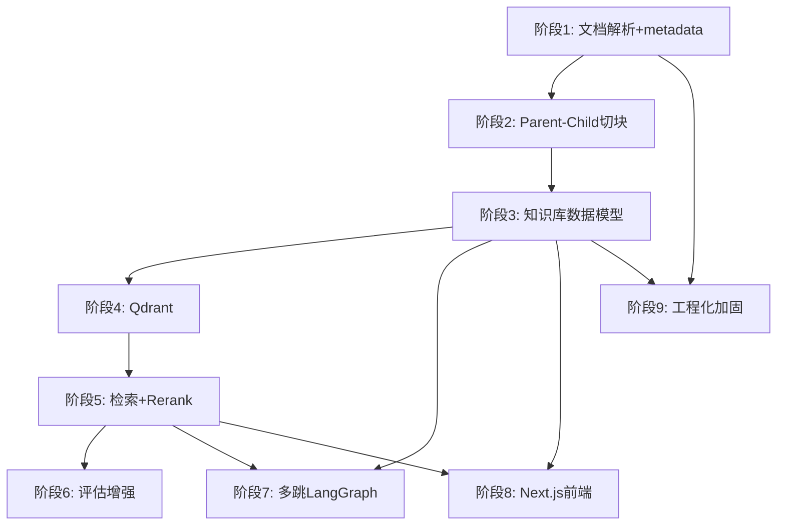

# 分阶段实施路线图

**日期**: 2026-07-30
**基于**: [架构审计报告](./architecture-audit.md)

---

## 推荐实施顺序

原始候选顺序经过审计后调整为：

| 阶段 | 名称 | 调整原因 |
|------|------|---------|
| 1 | 文档解析和可追溯 metadata | 必须先解决 chunk ID 一致性问题 |
| 2 | 结构化切块 (Parent-Child) | 解决 LightRAG 切块与原始 chunk ID 映射 |
| 3 | 知识库和文档生命周期数据模型 | 所有后续阶段都依赖 KB 实体 |
| 4 | Qdrant 向量存储 | LightRAG 原生支持，低成本升级 |
| 5 | LightRAG 检索与 Rerank | Qdrant 就绪后再优化检索 |
| 6 | 黄金集和自动评估增强 | 基于新检索管线重做基线 |
| 7 | 多跳检索 (LangGraph) | 检索和评估稳定后再做 |
| 8 | Next.js 前端 | 后端 API 稳定后再迁移 |
| 9 | 工程化和安全加固 | 最后做 CI/CD、监控、安全 |

---

## 阶段 1：文档解析和可追溯 metadata

### 阶段目标
确保每个 chunk 在整个处理链路中保持稳定且可追溯的 ID，修复当前 LightRAG 内部二次切块导致的 chunk ID 不一致问题。

### 前置条件
- 当前代码可运行
- 228 个测试通过
- 两份 PDF 可用

### 涉及模块
- `src/industrial_rag/document_parser.py`
- `src/industrial_rag/lightrag_service.py`
- `src/industrial_rag/citation_formatter.py`
- `scripts/parse_manuals.py`
- `scripts/ingest_documents.py`

### 预计修改文件
- `src/industrial_rag/document_parser.py` — 增加 token 计数、`chunk_token_size` 参数
- `src/industrial_rag/lightrag_service.py` — 将 `chunk_token_size` 从 1600 调至 1800（对齐解析器），或关闭 LightRAG 内部切块
- `src/industrial_rag/citation_formatter.py` — 确保引用解码与 LightRAG 内部 chunk ID 兼容
- `scripts/ingest_documents.py` — 增加 chunk lineage 日志
- `tests/test_document_parser.py` — 增加 token 计数测试
- `tests/test_lightrag_service.py` — 增加 chunk ID 一致性测试

### 数据迁移风险
- **中等**：重新解析和重新索引需要备份现有 `lightrag_storage/`
- 解析产出 `documents.jsonl` 格式不变，向后兼容

### 对现有功能的影响
- `ingest()` 中的 chunk 连接方式可能调整
- 引用中的 chunk_id 格式可能变化（需同步更新黄金集）

### 测试重点
- chunk_id 在 parse → ingest → retrieve → cite 全链路一致性
- 中英文混合文本的 token 计数准确性
- PDF 页码映射准确性

### 验收标准
- [ ] 解析后的 chunk_id 与检索结果中的 chunk_id 可对应
- [ ] 引用中的 chunk_id 可追溯到原始 documents.jsonl
- [ ] 黄金集 50 题评估结果不退化

### 回滚方案
恢复备份的 `lightrag_storage/` 目录，重新安装旧版本代码。

---

## 阶段 2：结构化切块 (Parent-Child)

### 阶段目标
实现父块（完整段落/语义单元）和子块（向量检索单元）的两级结构。父块保留上下文，子块用于精确检索。

### 前置条件
- 阶段 1 完成
- 确认 LightRAG `split_by_character_only=True` 与 `chunk_token_size` 的交互行为

### 涉及模块
- `src/industrial_rag/document_parser.py`
- `src/industrial_rag/lightrag_service.py`
- `data/processed/` — 新增父块存储

### 预计修改文件
- `src/industrial_rag/document_parser.py` — 新增 `ParentChunk` 和 `ChildChunk` 数据类
- `src/industrial_rag/lightrag_service.py` — `ingest()` 分两次写入：父块存文件、子块送 LightRAG
- `src/industrial_rag/citation_formatter.py` — 增加 `parent_chunk_id` 字段
- `data/processed/parent_chunks.jsonl` — 新增
- `scripts/parse_manuals.py` — 增加父块生成逻辑

### 数据迁移风险
- **高**：需要完全重新解析和重新索引
- 父块存储方案需要在 Qdrant（阶段 4）到位前先落地文件

### 对现有功能的影响
- 解析器输出格式变化（`documents.jsonl` 可能拆分为 parent + child）
- `ingest()` 接口需支持两次写入
- 引用展示需要区分父块和子块

### 测试重点
- 父块包含完整语义上下文（表格、步骤不被截断）
- 子块检索精度不低于当前基线
- Parent-Child 引用可正确展示

### 验收标准
- [ ] 每个子块有对应的 `parent_chunk_id`
- [ ] 父块内容完整包含子块上下文
- [ ] 检索召回 ≥ 当前基线
- [ ] 父块中的表格、列表、安全警告保持完整

### 回滚方案
保留阶段 1 的 `documents.jsonl` 格式向后兼容，通过 feature flag 切换。

---

## 阶段 3：知识库和文档生命周期数据模型

### 阶段目标
建立知识库和文档的完整数据模型，实现 CRUD API 和状态管理。

### 前置条件
- 阶段 1-2 完成（chunk 稳定性）
- 引入关系数据库（SQLite 作为开发环境，PostgreSQL 作为生产环境）
- 或使用文件 manifest + JSON 实现轻量级管理

### 涉及模块
- `src/industrial_rag/models/` — 新增
- `src/industrial_rag/repositories/` — 新增
- `src/industrial_rag/api.py` — 新增 KB CRUD 路由
- `src/industrial_rag/kb_manager.py` — 新增

### 预计新增文件
- `src/industrial_rag/models/knowledge_base.py`
- `src/industrial_rag/models/document.py`
- `src/industrial_rag/models/chunk.py`
- `src/industrial_rag/models/ingestion_task.py`
- `src/industrial_rag/repositories/kb_repository.py`
- `src/industrial_rag/routers/kb_router.py`
- `src/industrial_rag/routers/document_router.py`
- `src/industrial_rag/services/kb_service.py`
- `src/industrial_rag/services/document_service.py`
- `src/industrial_rag/services/ingestion_service.py`

### 数据模型建议

```python
# KnowledgeBase
class KnowledgeBase(BaseModel):
    id: str                          # UUID
    name: str                        # 用户可见名称
    description: str | None
    workspace_path: str              # LightRAG working_dir
    status: Literal["ready", "indexing", "error"]
    document_count: int
    chunk_count: int
    embedding_model: str             # text-embedding-v4
    embedding_dimension: int         # 1024
    created_at: datetime
    updated_at: datetime

# Document
class Document(BaseModel):
    id: str                          # 格式: manual-{sha256[:20]}
    knowledge_base_id: str
    file_name: str                   # 原始文件名
    file_hash: str                   # SHA256
    version: int                     # 上传版本
    parse_status: Literal["pending", "parsing", "done", "failed"]
    index_status: Literal["pending", "indexing", "done", "failed"]
    page_count: int
    chunk_count: int
    error_message: str | None
    created_at: datetime
    updated_at: datetime

# IngestionTask
class IngestionTask(BaseModel):
    task_id: str                     # LightRAG track_id
    knowledge_base_id: str
    document_id: str
    task_type: Literal["insert", "update", "delete"]
    status: Literal["pending", "processing", "done", "failed"]
    progress: float                  # 0.0 - 1.0
    current_stage: str               # "parsing" | "chunking" | "embedding" | "entity_extraction"
    error_message: str | None
    created_at: datetime
    finished_at: datetime | None
```

### 数据迁移风险
- **高**：需要为现有 2 份文档创建知识库和文档记录
- LightRAG 内部 KV 数据无法轻易迁移到关系数据库
- 需要决定：关系数据库是 source of truth，还是 LightRAG 内部状态

### 对现有功能的影响
- 新增路由注册到 FastAPI app
- `Settings.working_dir` 将从单一路径变为按 KB 动态选择
- Streamlit 前端需要适配 KB 选择

### 测试重点
- KB CRUD 事务完整性
- 删除 KB 后所有关联数据清理
- 并发写入安全性
- 重复上传去重

### 验收标准
- [ ] 可以创建、查询、编辑、删除知识库
- [ ] 可以上传、删除、重新解析文档
- [ ] 删除知识库时所有关联数据一致删除
- [ ] 删除失败时可以重试
- [ ] API 文档自动生成 (OpenAPI)

### 回滚方案
保持单 KB 模式作为默认行为，通过 feature flag 启用多 KB。

---

## 阶段 4：Qdrant 向量存储

### 阶段目标
将向量存储从 NanoVectorDB (JSON 文件) 迁移到 Qdrant，支持按知识库隔离 Collection。

### 前置条件
- 阶段 3 完成（KB 实体存在）
- Qdrant 服务可用（Docker 或云服务）
- 确认 LightRAG `QdrantVectorDBStorage` 的 workspace 机制

### 涉及模块
- `src/industrial_rag/lightrag_service.py`
- `docker-compose.yml` — 新增 Qdrant 服务
- `.env.example` — 新增 Qdrant 配置

### 预计修改文件
- `src/industrial_rag/lightrag_service.py` — `build_official_backend()` 中传入 `vector_storage="QdrantVectorDBStorage"`
- `.env.example` — 新增 `QDRANT_URL`, `QDRANT_API_KEY`
- 新增 `docker-compose.yml` (或 `compose.yaml`)
- `src/industrial_rag/config.py` — 新增 Qdrant 配置项

### LightRAG Qdrant 接入方式

```python
rag = LightRAG(
    working_dir=str(settings.working_dir),
    vector_storage="QdrantVectorDBStorage",
    vector_db_storage_cls_kwargs={
        "url": settings.qdrant_url,
        "api_key": settings.qdrant_api_key,
    },
    # 保留 JSON KV 和 NetworkX graph
    kv_storage="JsonKVStorage",
    graph_storage="NetworkXStorage",
    doc_status_storage="JsonDocStatusStorage",
    # ... 其他参数不变
)
```

### 数据迁移风险
- **高**：现有 NanoVectorDB 向量数据无法直接迁移到 Qdrant
- 需要重新执行索引（重新 embedding 调用）
- embedding API 调用费用（2 份文档 x ~100 chunks，成本极低）

### 对现有功能的影响
- 检索行为相同（LightRAG 内部适配）
- 需要 Qdrant 服务运行
- 增加 Docker 依赖

### 测试重点
- 新旧存储检索精度对比
- Qdrant Collection 隔离
- 删除 KB 时 Qdrant Points 清理
- Qdrant 服务不可用时的降级行为

### 验收标准
- [ ] Qdrant 中每个 KB 有独立 Collection
- [ ] 检索精度 ≥ NanoVectorDB 基线
- [ ] 删除 KB 时对应 Collection 或 Points 被清理
- [ ] embedding 维度固定 1024

### 回滚方案
切回 `vector_storage="NanoVectorDBStorage"`，保留 JSON 向量文件。

---

## 阶段 5：LightRAG 检索与 Rerank

### 阶段目标
接入 Rerank 模型，新增纯检索接口，优化证据策略。

### 前置条件
- 阶段 4 完成（Qdrant 可用）
- DashScope Rerank API 可用（需确认端点）
- 文档量增长到需要 rerank 的规模（>1000 chunks）

### 涉及模块
- `src/industrial_rag/lightrag_service.py`
- `src/industrial_rag/evidence_policy.py`
- `src/industrial_rag/api.py` — 新增 `/v1/retrieve` 纯检索端点

### 预计修改文件
- `src/industrial_rag/lightrag_service.py` — 启用 `rerank_model_func`，新增 `retrieve_only()` 方法
- `src/industrial_rag/api.py` — 新增 `POST /v1/retrieve`
- `src/industrial_rag/config.py` — 新增 `RERANK_MODEL` 配置

### 数据迁移风险
- **低**：不改变存储结构，仅改变查询行为

### 对现有功能的影响
- 纯检索接口新增，不影响 `/v1/query`
- `enable_rerank=True` 可能在少量文档时增加延迟而无收益

### 测试重点
- Rerank 前后的检索精度对比
- Rerank API 失败降级
- 纯检索接口的引用完整性

### 验收标准
- [ ] Rerank 模型可正常调用
- [ ] 检索精度不退化（≥ 当前基线）
- [ ] Rerank 失败时自动降级为无 rerank 模式
- [ ] `/v1/retrieve` 接口可用

### 回滚方案
`enable_rerank=False`，移除 `rerank_model_func`，功能完全回退。

---

## 阶段 6：黄金集和自动评估增强

### 阶段目标
基于新检索管线重新建立基线，扩展黄金集，增加语义评估。

### 前置条件
- 阶段 1-5 完成
- 新检索管线稳定

### 涉及模块
- `src/industrial_rag/evaluation.py`
- `data/evaluation/`
- `scripts/evaluate.py`

### 预计修改文件
- `src/industrial_rag/evaluation.py` — 新增 RAGAS 集成（可选）
- `data/evaluation/` — 扩充黄金集
- `scripts/evaluate.py` — 支持多 KB 评估

### 数据迁移风险
- **低**：黄金集格式向后兼容

### 验收标准
- [ ] 新基线 Recall@5 ≥ 当前基线 (0.757143)
- [ ] 引用可追溯率 ≥ 0.95
- [ ] 拒答率 ≥ 0.90
- [ ] 评估脚本可重复运行

---

## 阶段 7：多跳检索 (LangGraph)

### 阶段目标
使用 LangGraph 编排多跳检索推理，支持需要跨文档、跨章节的复杂问题。

### 前置条件
- 阶段 1-6 完成
- 确认业务问题中存在真正的多跳需求
- LangGraph 版本锁定（注意 lockfile 版本不一致问题）

### 涉及模块
- `src/industrial_rag/graph/` — 新增
- `src/industrial_rag/workflow/` — 新增

### 预计新增文件
- `src/industrial_rag/graph/state.py` — AgentState
- `src/industrial_rag/graph/nodes.py` — 检索、生成、判断节点
- `src/industrial_rag/graph/builder.py` — StateGraph 构建
- `src/industrial_rag/graph/checkpointer.py` — 会话持久化

### 风险
- LangGraph lockfile 版本 (1.2.9) 与环境版本 (0.6.11) 不一致
- 多跳会增加 API 调用次数和延迟
- 需要限制最大跳数和循环检测

### 验收标准
- [ ] 多跳问题正确分解为子问题
- [ ] 每跳产生新证据（无重复循环）
- [ ] 最大 3 跳限制
- [ ] 单跳问题不触发多跳（保持延迟不增加）

---

## 阶段 8：Next.js 前端

### 阶段目标
将 Streamlit 前端迁移到 Next.js，支持知识库管理 UI 和更好的用户体验。

### 前置条件
- 阶段 3-5 完成（API 稳定）
- 后端提供完整的 OpenAPI 规范
- Node.js 环境可用

### 涉及内容
- 全新 `frontend/` 目录
- Next.js + TypeScript + Tailwind CSS
- API Client 自动生成（OpenAPI → TypeScript）

### 预计新增
- `frontend/package.json`
- `frontend/src/app/`
- `frontend/src/components/`
- `frontend/src/lib/api-client.ts`

### 风险
- 这是一个全新项目，需要独立部署
- 与 Python 后端需要 API 契约对齐
- 需要 TypeScript/React 开发者资源

---

## 阶段 9：工程化和安全加固

### 阶段目标
CI/CD、Docker 部署、监控、安全审计、性能优化。

### 涉及内容
- Dockerfile + docker-compose.yml (含 Qdrant + FastAPI + Next.js)
- GitHub Actions CI (test + lint + typecheck)
- 健康检查 + 就绪探针
- 请求限流
- API Key 轮换
- 日志审计
- 性能基准测试

### 风险
- 需要稳定的基础设施环境
- 安全加固不能影响正常功能

---

## 依赖关系图


